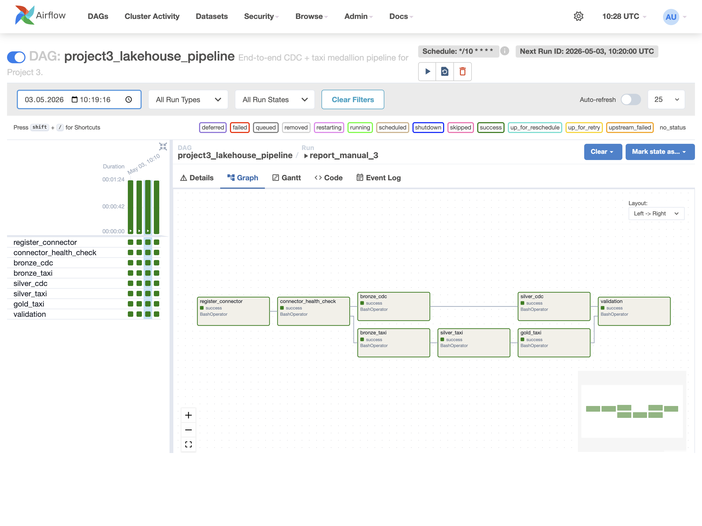

# Project 3 Report

Group B: Kaur Kaitsa, Roby Palumaee, Artem Lishchuk

## 1. Solution Overview

This submission implements one Airflow-orchestrated lakehouse pipeline with two paths:

1. CDC path: PostgreSQL `sourcedb.public.customers` and `sourcedb.public.drivers` -> Debezium -> Kafka -> Iceberg bronze -> Iceberg silver.
2. Taxi path: Kafka `taxi-trips` -> Iceberg bronze -> Iceberg silver -> Iceberg gold.

The main DAG is:

```text
register_connector
	-> connector_health_check
	-> [bronze_cdc, bronze_taxi]
	-> [silver_cdc, silver_taxi]
	-> gold_taxi
	-> validation
```

Implementation files:

- `compose.yml`: service wiring and Jupyter runtime environment, including the Spark package and Python path settings used by Airflow-triggered jobs.
- `dags/cdc_pipeline.py`: Airflow DAG, retries, timeout, failure callback, task dependency chain.
- `jobs/pipeline.py`: Debezium registration, health check, bronze ingestion, silver merges, gold aggregations, validation.

The Debezium connector uses `snapshot.mode=initial`. We chose this because the lakehouse starts empty and needs a full bootstrap of the current PostgreSQL state before processing ongoing WAL changes.

## 2. CDC Correctness

### 2.1 PostgreSQL -> silver parity

The validation task compares PostgreSQL rows against the silver Iceberg tables for both `customers` and `drivers`.

Stable baseline after the initial successful runs:

| Table | Rows |
| --- | ---: |
| `lakehouse.cdc.silver_customers` | 10 |
| `lakehouse.cdc.silver_drivers` | 8 |

Spot-check for customers matched exactly between PostgreSQL and Iceberg silver:

```text
PostgreSQL customers (first 3 rows)
1 | Alice Mets    | alice@example.com | Estonia | 2026-05-03 09:50:47.824387
2 | Bob Virtanen  | bob@example.com   | Finland | 2026-05-03 09:50:47.824387
3 | Carol Ozols   | carol@example.com | Latvia  | 2026-05-03 09:50:47.824387

silver_customers (first 3 rows)
1 | Alice Mets    | alice@example.com | Estonia | 2026-05-03 09:50:47.824387
2 | Bob Virtanen  | bob@example.com   | Finland | 2026-05-03 09:50:47.824387
3 | Carol Ozols   | carol@example.com | Latvia  | 2026-05-03 09:50:47.824387
```

### 2.2 Delete propagation

We deleted customer `id = 10` (`Javier Garcia`) directly in PostgreSQL and triggered Airflow run `report_delete_customer_10`.

PostgreSQL after delete:

```text
customer_count | id_10_count
9              | 0
```

Silver Iceberg after the DAG completed:

```text
customer_count | id_10_count
9              | 0
```

The follow-up query `SELECT id, name, email, country FROM lakehouse.cdc.silver_customers WHERE id = 10;` returned no rows, so the delete propagated correctly from PostgreSQL -> Debezium -> Kafka -> bronze -> silver.

### 2.3 Why the silver merge is idempotent

The silver CDC job is idempotent for two reasons:

1. Bronze is append-only and only ingests Kafka offsets that are not already present in the bronze table for each `(topic, partition)`.
2. Silver reads only bronze rows newer than the stored `job_watermarks`, keeps only the latest event per primary key via `ROW_NUMBER() OVER (PARTITION BY id ORDER BY source_ts_ms DESC, source_offset DESC)`, and then executes `MERGE INTO`.

Delete handling is:

- `op = 'd'` -> `DELETE`
- `op in ('c', 'r', 'u')` -> `UPDATE` or `INSERT`

Running the DAG twice with no new source changes leaves the silver state unchanged.

### 2.4 Consecutive successful runs

We verified at least three consecutive successful manual runs:

| Run ID | State | Start | End |
| --- | --- | --- | --- |
| `report_manual_1` | success | 2026-05-03 10:21:49 | 2026-05-03 10:23:13 |
| `report_manual_2` | success | 2026-05-03 10:23:14 | 2026-05-03 10:24:37 |
| `report_manual_3` | success | 2026-05-03 10:24:38 | 2026-05-03 10:26:03 |

Two additional validation runs also succeeded later:

- `report_connect_recovery`
- `report_delete_customer_10`

## 3. Lakehouse Design

### 3.1 Table layout

| Layer | Table | Important columns | Notes |
| --- | --- | --- | --- |
| CDC bronze | `lakehouse.cdc.bronze_cdc_events` | raw `key`, raw `value`, `topic`, `partition`, `offset`, `timestamp`, `source_table`, `op`, `before_json`, `after_json`, `ts_ms`, `snapshot`, `is_tombstone`, `ingested_at` | Append-only raw Debezium envelope. Partitioned by `source_table`. |
| CDC silver | `lakehouse.cdc.silver_customers` | `id`, `name`, `email`, `country`, `created_at`, `source_ts_ms`, `source_op`, Kafka metadata, `updated_at` | Current-state mirror of PostgreSQL `customers`. |
| CDC silver | `lakehouse.cdc.silver_drivers` | `id`, `name`, `license_number`, `rating`, `city`, `active`, `created_at`, source metadata | Current-state mirror of PostgreSQL `drivers`. |
| Taxi bronze | `lakehouse.taxi.bronze_raw_events` | raw Kafka payload plus `topic`, `partition`, `offset`, `timestamp`, `ingested_at` | Raw taxi topic landing zone. |
| Taxi silver | `lakehouse.taxi.silver_trips` | trip timestamps, `trip_duration_min`, location IDs, boroughs, zones, fares, tips, total amount, source metadata | Cleaned, deduplicated, zone-enriched trip facts. Partitioned by `pickup_date`. |
| Taxi gold | `lakehouse.taxi.gold_trips_per_hour` | `pickup_date`, `pickup_hour`, `trip_count` | Hourly trip volume. |
| Taxi gold | `lakehouse.taxi.gold_average_fare_per_zone` | `pickup_date`, pickup zone columns, `average_fare` | Average fare by pickup zone. |
| Taxi gold | `lakehouse.taxi.gold_revenue_per_zone` | `pickup_date`, pickup zone columns, `total_revenue` | Revenue by pickup zone. |
| Taxi gold | `lakehouse.taxi.gold_trip_segments` | `pickup_date`, `segment_name`, `trip_count`, `trip_share_pct`, `average_fare`, `average_tip`, `total_revenue`, `average_trip_duration`, `most_common_pickup_zone`, `revenue_per_trip` | Custom scenario aggregate. |
| Taxi gold | `lakehouse.taxi.gold_segment_trends` | `pickup_date`, `segment_name`, `previous_trip_count`, `trip_count_change`, `trip_count_change_pct`, `trend_direction` | Custom scenario day-over-day trend table. |

### 3.2 Iceberg snapshot history

Recent `lakehouse.cdc.silver_customers.snapshots` history:

```text
committed_at            operation  added_records  deleted_records
2026-05-03 10:51:02.203 overwrite  9              10
2026-05-03 10:13:39.243 overwrite  10             10
2026-05-03 10:09:05.527 append     10             NULL
```

Interpretation:

- The first `append` snapshot is the initial load.
- The next `overwrite` snapshot is a silver refresh/merge that rewrote the current-state file set.
- The latest `overwrite` snapshot is the delete test: the table moved from 10 current customer rows to 9.

### 3.3 Rolling back a bad merge

Iceberg makes rollback straightforward because every merge creates a new snapshot. The recovery workflow is:

1. Inspect snapshot history in `lakehouse.cdc.silver_customers.snapshots`.
2. Query the old version with time travel, for example:

```sql
SELECT *
FROM lakehouse.cdc.silver_customers VERSION AS OF <snapshot_id>;
```

3. Roll back if needed:

```sql
CALL lakehouse.system.rollback_to_snapshot(
	table => 'cdc.silver_customers',
	snapshot_id => <snapshot_id>
);
```

## 4. Orchestration Design



### 4.1 Task ordering

The order is intentional:

1. `register_connector` ensures the Debezium connector exists.
2. `connector_health_check` ensures the connector and all tasks are `RUNNING` before any data work starts.
3. `bronze_cdc` and `bronze_taxi` can run in parallel because they read independent Kafka topics.
4. `silver_cdc` depends only on CDC bronze; `silver_taxi` depends only on taxi bronze.
5. `gold_taxi` depends on `silver_taxi`.
6. `validation` waits for both `silver_cdc` and `gold_taxi`, so source/silver checks only happen after both paths finish.

If the connector registration or health check fails, no downstream bronze, silver, gold, or validation task runs.

### 4.2 Schedule and freshness SLA

The DAG schedule is `*/10 * * * *`.

Observed successful run times were roughly 85-95 seconds. With a 10-minute schedule, that gives an end-to-end freshness SLA of about 11-12 minutes in steady state. We chose 10 minutes because it is frequent enough to demonstrate near-real-time refresh locally, but not so frequent that the local Docker stack overlaps runs or thrashes the Spark container.

The DAG also sets `max_active_runs=1` to avoid overlapping intervals.

### 4.3 Retry and failure handling

Airflow settings in `dags/cdc_pipeline.py`:

- `retries = 2`
- `retry_delay = 2 minutes`
- `retry_exponential_backoff = True`
- `max_retry_delay = 10 minutes`
- `execution_timeout = 15 minutes` per task
- `dagrun_timeout = 40 minutes`
- failure callback `send_failure_alert()` logs a JSON payload and posts it to `ALERT_WEBHOOK_URL` when configured

Concrete failure example:

- We stopped Kafka Connect and triggered run `report_connect_recovery`.
- `register_connector` attempt 1 started at `2026-05-03 10:39:40`.
- It failed at `2026-05-03 10:40:40` with:

```text
RuntimeError: Kafka Connect did not become ready: HTTPConnectionPool(host='connect', port=8083):
Max retries exceeded with url: / (Caused by NameResolutionError(... Failed to resolve 'connect' ...))
```

- Airflow marked the task `UP_FOR_RETRY`.
- We restarted Kafka Connect.
- Attempt 2 ran at `2026-05-03 10:44:28` and succeeded.
- `connector_health_check` succeeded immediately after, the downstream bronze/silver/gold tasks resumed, and the whole run finished `success` at `2026-05-03 10:45:55`.

This demonstrates that the DAG stops safely on upstream infrastructure failure and recovers automatically once the dependency is restored.

### 4.4 Backfill strategy

We kept `catchup=False` so local stack startup does not flood the machine with historical runs. Backfill is still possible, but it is intentional instead of automatic:

1. Trigger a manual run or clear a historical run.
2. Bronze remains safe because it only appends unseen Kafka offsets.
3. Silver remains safe because it merges latest-per-key events.

For a true historical replay from bronze into silver, the relevant watermark rows in `lakehouse.system.job_watermarks` can be reset and the silver tasks rerun.

## 5. Streaming Taxi Pipeline

The Project 2 taxi path now runs under Airflow rather than as an ad-hoc notebook workflow.

Validated row counts from the working pipeline:

| Table | Rows |
| --- | ---: |
| `lakehouse.taxi.bronze_raw_events` | 200 |
| `lakehouse.taxi.silver_trips` | 195 |
| `lakehouse.taxi.gold_trips_per_hour` | 2 |
| `lakehouse.taxi.gold_average_fare_per_zone` | 47 |
| `lakehouse.taxi.gold_revenue_per_zone` | 47 |

Improvements over Project 2:

1. Taxi bronze ingestion now uses the Spark Kafka source directly instead of relying on a separate Python consumer path.
2. Timestamp parsing is normalized before casting, which avoids ANSI parsing failures on the input format.
3. Silver deduplication is deterministic: the job keeps the newest row for a composite trip key ordered by Kafka offset.
4. Zone enrichment is part of the repeatable silver transformation instead of being left to notebook-only logic.
5. All transforms are now idempotent batch steps inside Airflow, so the same DAG handles retries, run history, and validation.

## 6. Custom Scenario

The assigned GitHub issue was: `Project 3 Issue: Trip Distance Segmentation Report` (#14).

We implemented two additional gold tables:

- `lakehouse.taxi.gold_trip_segments`
- `lakehouse.taxi.gold_segment_trends`

Segment rules:

- `Airport run`: pickup zone or dropoff zone contains `airport`
- `Short hop`: `trip_distance < 2`
- `City ride`: `2 <= trip_distance <= 10`
- `Long haul`: `trip_distance > 10` and not airport

Daily segment output for the available dataset:

| pickup_date | segment_name | trip_count | trip_share_pct | average_fare | average_tip | total_revenue | average_trip_duration | most_common_pickup_zone | revenue_per_trip |
| --- | --- | ---: | ---: | ---: | ---: | ---: | ---: | --- | ---: |
| 2025-01-01 | Airport run | 8 | 4.10 | 40.65 | 6.63 | 463.74 | 24.00 | LaGuardia Airport | 57.97 |
| 2025-01-01 | City ride | 75 | 38.46 | 22.53 | 4.96 | 2434.92 | 21.88 | East Village | 32.47 |
| 2025-01-01 | Long haul | 3 | 1.54 | 61.33 | 5.79 | 233.76 | 36.48 | East Chelsea | 77.92 |
| 2025-01-01 | Short hop | 109 | 55.90 | 9.65 | 2.13 | 1819.74 | 8.67 | Sutton Place/Turtle Bay North | 16.69 |

Required question 1, "Which segment generates the most revenue per trip?":

- `Long haul`, with `revenue_per_trip = 77.92`.

Required question 2, "Are airport runs increasing or decreasing day-over-day?":

- On the currently ingested dataset there is only one `pickup_date` (`2025-01-01`), so the trend table correctly reports `previous_trip_count = NULL`, `trip_count_change = NULL`, and `trend_direction = NULL` for `Airport run`.
- In other words, the trend logic is implemented, but the available data does not yet contain multiple days to classify airport traffic as increasing or decreasing.

## 7. Artifacts

- Airflow graph screenshot: `artifacts/airflow-graph-report-manual-3.png`
- Main DAG: `dags/cdc_pipeline.py`
- Main pipeline entrypoint: `jobs/pipeline.py`
- Delete propagation run: `report_delete_customer_10`
- Failure and recovery run: `report_connect_recovery`

## 8. Environment Credentials

The `.env` values used in the working local run were:

```text
MINIO_ROOT_USER=admin
MINIO_ROOT_PASSWORD=pswd9999
PG_USER=cdc_user
PG_PASSWORD=admin
JUPYTER_TOKEN=admin
AIRFLOW_USER=admin
AIRFLOW_PASSWORD=admin
```

These values are documented here because the assignment explicitly requires section 8 to include the runtime credentials used for the submission.

